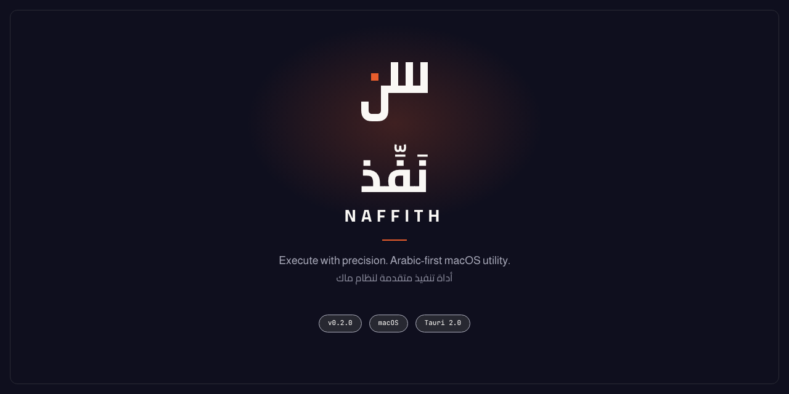

<div align="center">



[](https://github.com/iSltanX/naffith)
[](https://github.com/iSltanX/naffith)
[](https://github.com/iSltanX/naffith)
[](https://github.com/iSltanX/naffith)
[](https://github.com/iSltanX/naffith)

</div>

---

## ما هو نفّذ؟ — What is Naffith?

**نَفِّذ** *(Naffith — "execute")* أداةٌ أصيلة لنظام macOS، تحوّل مهامّ النظام
اليومية — نقل ملف، ضغط مجلد، فحص عملية Git، معرفة المساحة الحرة — من أوامر
تُكتب في الطرفية إلى عملياتٍ تُختار بالاسم من قائمة، بواجهةٍ عربية من اليمين
إلى اليسار أولًا، ودعمٍ إنجليزي كامل إلى جانبها.

المشكلة التي يحلّها بسيطة: كثيرٌ من مهام macOS اليومية لا طريق إليها إلا
الطرفية (Terminal) — حفظُ صيغة أمرٍ، وحروف flags لا تُذكر، وواجهةٌ لا تتحدّث
العربية أصلًا. نفّذ يضع بينك وبين النظام طبقةً هادئة: تختار ما تريد بالاسم لا
بالأمر، ويبقى الأمر نفسه معروضًا أمامك قبل أن يعمل — لا صندوقًا أسود.

> افعلْ ما تريد، وافهمْ ما فعلت.

تطبيقٌ macOS أصيل بالكامل — نواته Rust وواجهته React داخل Tauri 2 — يعمل على
جهازك مباشرةً، ولا يعتمد على أي خادمٍ خلفي. الاتصال بالشبكة يحدث فقط حين
تختار أنت عمليةً تطلبه صراحةً — كفحص عنوانٍ أو تنزيل ملف.

---

## ماذا يمكنك أن تفعل به؟ — What can it do?

**٧٩ عمليةً حقيقية عبر عشرة أقسام**، كلٌّ منها اسمٌ تختاره لا أمرٌ تحفظه:

- **الملفات والمجلدات** — نسخ ونقل وإنشاء، وبحثٌ عن الكبير والقديم، وقياسُ ما يشغل المساحة.
- **الضغط وفكّ الضغط** — أرشفة ZIP وTAR.GZ، وفكّها في مجلد جديد، وفحصُ محتوياتها قبل ذلك.
- **الصور** — تحويل الصيغة وتغيير الأبعاد والتدوير، وقراءةُ خصائص الصورة.
- **النصوص والمستندات** — دمج وتقسيم، وتحويل الترميز إلى UTF-8، ومقارنةٌ وبحثٌ داخل الملفات.
- **الأقراص ومساحة التخزين** — المساحة الحرة، وبصمات SHA-256، ومقارنةُ ملفين، والأقراص المتصلة.
- **الشبكة والاتصال** — اختبار الوصول وفحص DNS والمنافذ المستمعة، وتنزيلٌ من رابط.
- **الأمان والصلاحيات** — قراءة الصلاحيات والسمات الممتدّة والتواقيع. قراءةٌ فقط — لا يُعدَّل شيء.
- **Git ومستودعات الشفرة** — إنشاء مستودع، وحالته، وتسجيل commit، ومقارنةُ التغييرات وأرشفتها.
- **النظام والصيانة الدورية** — العمليات الأعلى استهلاكًا، ومعلومات النظام، وتفريغ ذاكرة DNS.
- **أدوات المطوّرين** — فحص الأنواع والأسلوب والاختبارات، وتشغيل مشاريع Node.js وTauri من داخل نفّذ.

والتفصيل الكامل — كل عمليةٍ باسمها — في **«العمليات المتاحة»** أدناه.

---

## كيف يعمل؟ — How it works

> طبقة هادئة بينك وبين النظام. تختار ما تريد، ونتكفّل نحن بالأمر — ويبقى الأمر
> معروضًا أمامك متى أردت أن تعرف ما الذي جرى.

أربع خطوات، لا أكثر:

1. **اختر العملية** — تفتح القائمة فترى كل ما يستطيع نفّذ تنفيذه، وتختار بالاسم لا بالأمر.
2. **أدخل القيم وراجع المعاينة** — تملأ حقلًا أو حقلين، فتظهر معاينةٌ تقول بالضبط ما الذي سيحدث قبل أن يحدث.
3. **شاهد الأمر في سَطْر** — الأمر نفسه، مكتوبًا ومشروحًا كلمةً كلمة، إن أردت أن تفهمه — وتتجاهله إن لم ترد.
4. **نفّذ، وشاهد النتيجة** — بعد تأكيدٍ (اختياري من الإعدادات) يُنفَّذ الأمر، وتظهر النتيجة مُهيكلة — جداول وحالة — لا نصًّا خامًا يحتاج قراءةً متأنية.

---

## أهم المزايا — Key features

| الميزة | Feature | الوصف |
|---|---|---|
| واجهة عربية RTL أصيلة | Native RTL Arabic UI | خطوط Cairo وAlmarai محمَّلة محليًا بلا اتصال، وواجهة إنجليزية كاملة إلى جانبها. |
| الأمر ظاهرٌ قبل التنفيذ | Command shown before it runs | كل عمليةٍ تُعرض كأمرٍ صريح مشروح — لا أسطر مخفية، لا مفاجآت. |
| عرض نتائج مُهيكل | Structured result view | نتائج بجداول وملخّصات وحالة، لا نصّ خامًا يُقرأ سطرًا سطرًا. |
| سجلّ العمليات السابقة | Run history | كل عمليةٍ سابقة مسجّلة بوقتها ونتيجتها، وتُعاد بالقيم نفسها بضغطة. |
| أدوات المطوّرين داخل التطبيق | In-app developer tools | فحص وبناء واختبار مشاريع Node.js وTauri — من داخل نفّذ لا الطرفية. |
| عمليات الأمان قراءةٌ فقط | Security ops are read-only | الصلاحيات والتواقيع وGatekeeper — تُقرأ ولا تُعدَّل أبدًا. |
| مظهرٌ متكيّف | Adaptive appearance | داكن وفاتح، بحسب النظام أو باختيارك. |

---

## العمليات المتاحة — Available operations

**٧٩ عمليةً عبر أحد عشر قسمًا.** العدد يُقرأ من الفهرس لا يُكتب يدويًا —
`cargo run --example dump_catalogue` يطبع القائمة الرسمية.

| القسم | Category | العمليات |
|---|---|---|
| أدوات المطوّرين | `developer` | 14 |
| Git ومستودعات الشفرة | `git` | 12 |
| الملفات والمجلدات | `files` | 10 |
| النظام والصيانة الدورية | `system` | 10 |
| الضغط وفكّ الضغط | `compress` | 7 |
| الشبكة والاتصال | `network` | 6 |
| الأقراص ومساحة التخزين | `disk` | 6 |
| النصوص والمستندات | `text` | 5 |
| الأمان والصلاحيات | `security` | 5 |
| الصور | `images` | 4 |
| سجلّ العمليات السابقة | `history` | يُقرأ من سجلّ التشغيل |

الفجوات المتبقّية — كتنفيذ عدة ملفات دفعةً واحدة، أو قراءة مخرجات أدوات
خارجية — فجواتٌ بنيوية معروفة، مشروحة ومقدَّرة الكلفة في
[`docs/roadmap.md`](docs/roadmap.md).

---

## الأمان — Security

نفّذ لا يشغّل نصًّا حرًّا في صدفةٍ خفية (shell). كل عمليةٍ أمرٌ واحدٌ محدَّد
الشكل، مدخلاته من حقولٍ مفحوصة لا من نصٍّ حر، ويُعرض عليك كاملًا قبل أن يُنفَّذ.

- **لا صدفة، لا حقن.** كل عملية `PlannedCommand` واحد — برنامجٌ ووسائطه — لا سلاسل نصية تُمرَّر إلى shell.
- **مدخلاتٌ مفحوصة.** كل حقلٍ نوعُه معروف (`InputKind`) ويُتحقَّق منه قبل بناء أي أمر.
- **ترقيةٌ آمنة.** الشروط المسبقة تُبصَم وقت التخطيط، والنواتج تُثبَّت دفعةً واحدة لا خطوةً خطوة.
- **سجلٌّ للمراجعة.** كل تشغيلٍ مسجَّلٌ في دفتر العمليات، فيمكن مراجعته لاحقًا.
- **عمليات الأمان قراءةٌ فقط.** فحص الصلاحيات والتواقيع وGatekeeper لا يُعدِّل شيئًا أبدًا.

---

## التثبيت — Installation

**المتطلبات:** macOS 12 أو أحدث (‏Apple Silicon أو Intel)، مع Node.js وأدوات Rust مثبّتة.

```bash
git clone https://github.com/iSltanX/naffith.git
cd naffith
npm install
```

لبناء نسخة `.dmg` / `.app` محلية (بلا توقيع):

```bash
npm run build
```

> مجموعة أيقونات macOS مُجمَّعةٌ لا مُشتقَّة — لا تُشغِّل `tauri icon` أبدًا.
> التفصيل في [`src-tauri/icons/README.md`](src-tauri/icons/README.md).

---

## الاستخدام — Usage

```bash
npm run dev          # التطبيق الكامل (Tauri + Vite)
npm run dev:web      # الواجهة فقط في المتصفح، بلا نواة Rust
```

اختر قسمًا، فعمليةً، فاملأ حقولها — يبني نفّذ الأمر، ويعرضه عليك كاملًا، ولا
يُنفِّذه إلا بعد موافقتك.

---

## الإعدادات — Settings

- **المظهر** — داكن / فاتح / حسب النظام.
- **اللغة** — عربية أو إنجليزية للواجهة.
- **مسارا الأدوات** — تحديد يدوي لمسار Node.js وCargo إن لم يُكتشفا تلقائيًا.
- **تأكيدٌ قبل التنفيذ** — طلب تأكيدٍ صريح قبل العمليات الحسّاسة أو غير القابلة للتراجع.
- **صوت الإشعارات** — عند انتهاء عمليةٍ طويلة.
- **مسار العمل الافتراضي** — المجلد الذي تبدأ منه العمليات.
- **شاشة الترحيب** — يمكن عرضها مجددًا من هنا في أي وقت.

---

## أدوات المطورين — Developer tools

للمساهمين — أوامر الفحص والاختبار قبل أي تعديل:

```bash
npm run typecheck    # tsc، للتطبيق والاختبارات
npm run lint         # eslint بلا أي تحذير
npm run test:ui      # اختبارات الواجهة (vitest)
npm run test:core    # اختبارات النواة (cargo test)
npm run lint:core    # cargo clippy، بمنع كل تحذير
npm run fmt:core     # cargo fmt --check
```

**ملاحظة معمارية:** النتائج تنتقل بين النواة والواجهة عبر عقدٍ نمطي
(‏`ResultContract`) لا نصٍّ خام، فتُرسم في الواجهة أقسامًا مُهيكلة — ملخّصات
وجداول وحالة — لا تحليل stdout في طبقة العرض.

---

## لقطات الشاشة — Screenshots

لقطات التطبيق لم تُرفع بعد. يحمل ملف الهوية خمسة أطر عرضٍ جاهزة — لقطة
مفردة، جنبًا إلى جنب، مقارنة سمتين، تركيزٌ على ميزة، وطرفيّةٌ مميّزة — على
صفحة **‏21 — GitHub & Repository Assets**، فتُلتقط الصور وتوضع مباشرةً في
إطارٍ واحد متّسق.

---

## المساهمة — Contributing

`docs/` نسخةٌ للقراءة فقط من مشروع الهوية — لا يُعدَّل شيء فيها يدويًا.
تصحيحات الهوية مكانها المشروع الأصل، ثم تُنسخ من جديد.

الاستثناء الوحيد [`docs/brand/github/`](docs/brand/github/)، وهو مُولَّد:

```bash
./docs/brand/github/_render/build.sh
```

يعيد بناء صور الرأس والبطل والمعاينة الاجتماعية من ملفات HTML المحفوظة،
باستخدام خطوط المشروع نفسها المحمَّلة محليًا — بلا اتصال، وبلا عودة إلى Figma.

قبل فتح طلب سحب، شغّل البوّابة الكاملة: `typecheck`، `lint`، `test:ui`،
`test:core`، `lint:core`، `fmt:core`.

---

## الترخيص — License

**لم يُرفع ملف ترخيص بعد.** إلى أن يوجد `LICENSE`، كل الحقوق محفوظةٌ افتراضيًا
والشارة محذوفةٌ عمدًا. أضِف الترخيص الذي تريده وتعود الشارة معه.

---

<div align="center">


**نَفِّذ — NAFFITH**

تطوير وتصميم سلطان

`github.com/iSltanX/naffith` · `v0.2.0`

</div>
