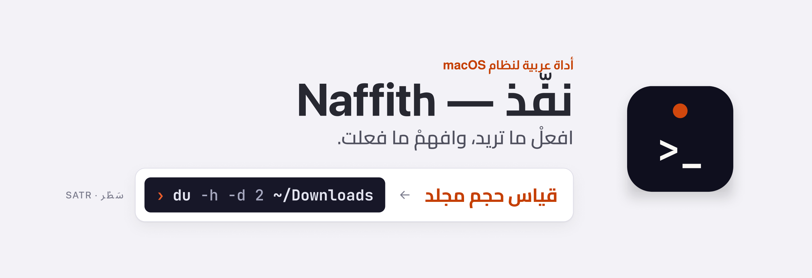
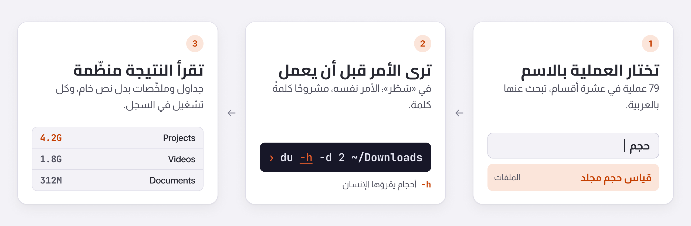
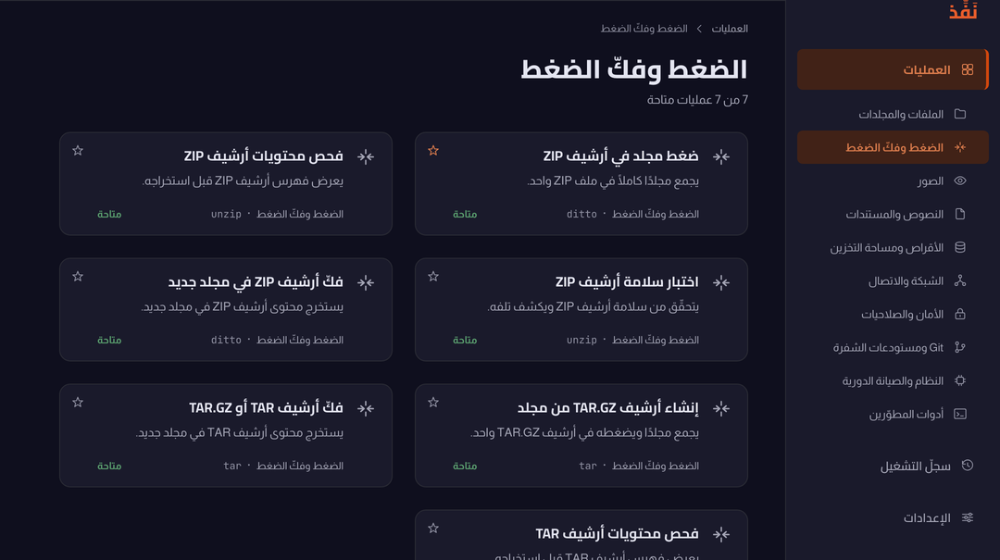
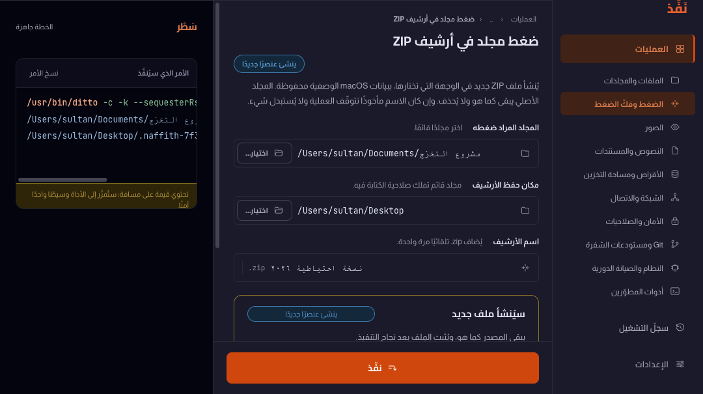
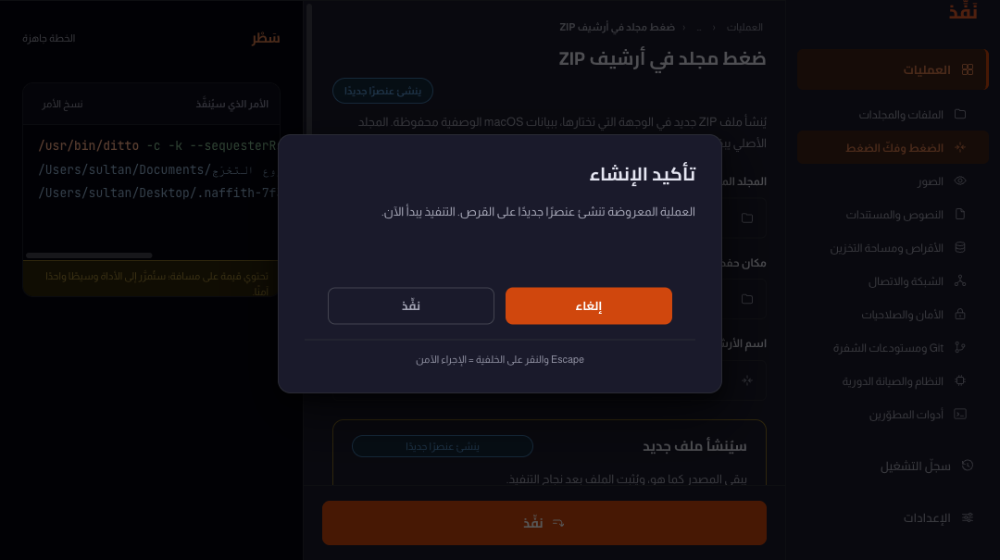
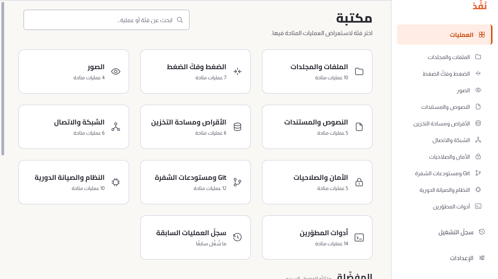

<picture>
  <source media="(prefers-color-scheme: dark)" srcset="docs/assets/header-ar-dark.png">
  
</picture>

### [⬇︎ تنزيل أحدث إصدار](https://github.com/iSltanX/naffith/releases/latest)

مجاني ومفتوح المصدر · macOS 12 أو أحدث · Apple Silicon

[الفكرة](#الفكرة) · [طريقة العمل](#طريقة-العمل) · [الميزات](#الميزات) · [التثبيت](#التثبيت) · [الاستخدام](#الاستخدام) · [لقطات الشاشة](#لقطات-الشاشة) · [الأمان](#الأمان) · [الأسئلة المتكررة](#الأسئلة-المتكررة)

---

## الفكرة

كثير من مهام macOS اليومية لا طريق إليها إلا الطرفية: صيغة أمر تحفظها، وحروف لا تتذكرها، وواجهة لا تتحدث العربية أصلًا.

**نفّذ** يضع بينك وبين النظام طبقة هادئة: تختار ما تريد بالاسم، لا بالأمر. نقل ملف، ضغط مجلد، فحص مستودع Git، معرفة المساحة الحرة. ويبقى الأمر نفسه معروضًا أمامك قبل أن يعمل، فلا شيء يحدث في الخفاء.

---

## طريقة العمل

<picture>
  <source media="(prefers-color-scheme: dark)" srcset="docs/assets/steps-ar-dark.png">
  
</picture>

1. **تختار العملية** من قائمة مقسّمة، أو تبحث عنها بالعربية.
2. **تملأ حقلًا أو حقلين،** فتظهر معاينة تقول بالضبط ما سيحدث.
3. **ترى الأمر في «سَطْر»،** مكتوبًا ومشروحًا كلمةً كلمة، إن أردت أن تفهمه.
4. **تؤكّد فيُنفَّذ،** وتظهر النتيجة جداول وملخّصات، لا نصًّا خامًا.

---

## الميزات

**79 عملية في عشرة أقسام:**

| القسم | أمثلة |
| --- | --- |
| **الملفات والمجلدات** | نسخ ونقل وإنشاء، والعثور على الملفات الكبيرة والقديمة، وقياس حجم مجلد |
| **الضغط** | أرشفة ZIP وTAR.GZ وفكّها، وفحص محتواها قبل ذلك |
| **الصور** | تحويل الصيغة، وتغيير الأبعاد، والتدوير، وقراءة الخصائص |
| **النصوص** | دمج وتقسيم، وتحويل الترميز إلى UTF-8، والمقارنة والبحث داخل الملفات |
| **الأقراص** | المساحة الحرة، وبصمة SHA-256، ومقارنة ملفين، والأقراص المتصلة |
| **الشبكة** | فحص الوصول وDNS والمنافذ المستمعة، والتنزيل من رابط |
| **الأمان** | قراءة الصلاحيات والسمات والتواقيع، دون تعديل أي شيء |
| **Git** | إنشاء مستودع، وحالته، وتسجيل commit، ومقارنة التغييرات |
| **النظام** | العمليات الأعلى استهلاكًا، ومعلومات النظام، وتفريغ ذاكرة DNS |
| **أدوات المطوّرين** | فحص الأنواع والأسلوب والاختبارات، وتشغيل مشاريع Node.js وTauri |

- **الأمر ظاهر قبل التنفيذ.** كل عملية تُعرض أمرًا صريحًا مشروحًا، بلا أسطر مخفية.
- **نتائج منظّمة.** جداول وملخّصات وحالة، بدل قراءة الخرج سطرًا سطرًا.
- **سجل العمليات.** كل تشغيل محفوظ بوقته ونتيجته، ويُعاد بالقيم نفسها بضغطة.
- **عربي أولًا.** واجهة من اليمين إلى اليسار بخطَّي Cairo وAlmarai، ووضعان فاتح وداكن.

---

## التثبيت

1. نزّل ملف `.dmg` من [صفحة الإصدارات](https://github.com/iSltanX/naffith/releases/latest).
2. افتحه واسحب **نفّذ** إلى مجلد **التطبيقات**.
3. شغّله، وتظهر شاشة ترحيب قصيرة تعرّفك بالأقسام وبلوحة «سَطْر».

> [!IMPORTANT]
> **تنبيه Gatekeeper:** نفّذ موقَّع ذاتيًا ولم يمرّ بتوثيق Apple (Notarization)، لأنه مشروع شخصي. لذلك يرفض macOS فتحه أول مرة.
>
> - **في macOS 15 فما بعد:** حاول فتحه مرة، ثم افتح **إعدادات النظام ← الخصوصية والأمن** واضغط **افتح على أي حال**.
> - **في macOS 12 إلى 14:** في Finder انقر على التطبيق بالزر الأيمن ← **فتح** ← **فتح**.
>
> تكفي مرة واحدة.

### المتطلبات

- نظام macOS 12 (Monterey) أو أحدث.
- معالج **Apple Silicon** للإصدار الجاهز. على Intel، ابنِه من المصدر ([للمطوّرين](#للمطوّرين)).
- أدوات المطوّرين وحدها تحتاج **Node.js** و**Cargo**، ويمكن تحديد مساريهما من الإعدادات.

---

## الاستخدام

اختر قسمًا من الشريط الجانبي، ثم عملية، ثم املأ حقولها. يبني نفّذ الأمر ويعرضه عليك، ولا ينفّذه إلا بعد موافقتك.

| من الإعدادات | ما يفعله |
| --- | --- |
| **تأكيد قبل التنفيذ** | يطلب موافقتك قبل كل عملية، وهو مفعّل افتراضيًا |
| **مسار العمل الافتراضي** | المجلد الذي تبدأ منه العمليات |
| **مظهر التطبيق** | داكن، أو فاتح، أو حسب النظام، وحجم أيقونات الشريط الجانبي |
| **صوت الإشعارات** | تنبيه عند انتهاء عملية طويلة |
| **أدوات المطوّرين** | مسارا Node.js وCargo إن لم يُكتشفا تلقائيًا |
| **شاشة الترحيب** | تعرضها من جديد متى شئت |

---

## لقطات الشاشة

<table>
  <tr>
    <td width="50%" align="center" valign="top">
       
      <b>الأقسام</b> 
      كل عملية باسمها ووصفها، في قسمها.
    </td>
    <td width="50%" align="center" valign="top">
       
      <b>العملية وسَطْر</b> 
      الحقول والمعاينة، والأمر مشروحًا قبل أن يعمل.
    </td>
  </tr>
  <tr>
    <td width="50%" align="center" valign="top">
       
      <b>التأكيد قبل التنفيذ</b> 
      يقول ما سيحدث، والخيار الآمن هو الافتراضي.
    </td>
    <td width="50%" align="center" valign="top">
       
      <b>المكتبة</b> 
      عشرة أقسام وسجل التشغيل، بالوضع الفاتح.
    </td>
  </tr>
</table>

---

## الأمان

نفّذ لا يشغّل نصًّا حرًّا في صدفة خفية (shell). كل عملية برنامج واحد محدَّد، ومدخلاتها من حقول مفحوصة، ويُعرض الأمر عليك كاملًا قبل أن يعمل.

- **حدود واضحة:** يعمل داخل مجلد المنزل و`/Volumes` فقط، ويرفض مجلدات حساسة مثل `~/.ssh` وسلسلة المفاتيح وملفات تعريف الارتباط.
- **لا صلاحيات مرتفعة:** لا يستخدم `sudo` أبدًا.
- **عمليات الأمان قراءة فقط:** فحص الصلاحيات والتواقيع وGatekeeper لا يعدّل شيئًا.
- **لا خادم ولا تتبّع:** يعمل على جهازك مباشرة، ولا يتصل بالشبكة إلا حين تشغّل أنت عملية شبكة، كفحص عنوان أو تنزيل ملف.

---

## الأسئلة المتكررة

<strong>لماذا يحذّرني macOS حين أفتحه أول مرة؟</strong>
 

لأن نفّذ موقَّع ذاتيًا لا بشهادة Apple Developer ID، ولم يمرّ بتوثيق Apple. طريقة الفتح في [التثبيت](#التثبيت)، وتكفي مرة واحدة.

<strong>هل يمكن أن يفسد نفّذ ملفاتي؟</strong>
 

كل عملية تُعرض عليك أمرًا صريحًا قبل تنفيذها، والتأكيد مفعّل افتراضيًا. ولا يعمل خارج مجلد المنزل والأقراص المتصلة، ولا يلمس المجلدات الحساسة، ولا يستخدم `sudo`.

<strong>هل يتصل بالإنترنت؟</strong>
 

فقط حين تشغّل عملية تحتاجه، كفحص وصول مضيف أو تنزيل ملف. لا حساب، ولا تحليلات، ولا تحقق تلقائي من التحديثات.

<strong>لماذا لا تعمل بعض عمليات النظام كاملة؟</strong>
 

لأن نفّذ لا يطلب صلاحيات المدير. تفريغ ذاكرة DNS مثلًا يتم جزئيًا، لأن جزءه الآخر يحتاج `sudo`.

<strong>هل الواجهة متاحة بالإنجليزية؟</strong>
 

ليس بعد. الواجهة عربية بالكامل حاليًا.

<strong>هل يعمل على معالجات Intel؟</strong>
 

الإصدار الجاهز لـ Apple Silicon. على Intel يمكنك بناؤه من المصدر، والخطوات في [للمطوّرين](#للمطوّرين).

<strong>كيف أحدّثه، وكيف أزيله؟</strong>
 

**التحديث** يدوي: نزّل الإصدار الجديد من صفحة الإصدارات واستبدل التطبيق.

**الإزالة:** احذف التطبيق من مجلد التطبيقات، ثم احذف مجلد بياناته `~/Library/Application Support/com.naffith.satr/` وفيه سجل آخر 500 عملية.

---

## للمطوّرين

<b>البناء من المصدر</b>
 

**المتطلبات:** macOS 12 أو أحدث، وأدوات سطر أوامر Xcode، وRust، وNode.js 22.22 أو 24.15 أو أحدث.

| الأمر | ما يفعله |
| --- | --- |
| `npm install` | يثبّت الاعتماديات |
| `npm run dev` | التطبيق كاملًا (Tauri وVite) |
| `npm run build` | يبني `.app` و`.dmg` محليًا، بلا توقيع |
| `npm run typecheck` · `npm run lint` | فحص الأنواع والأسلوب |
| `npm run test:ui` | اختبارات الواجهة (Vitest) |
| `npm run test:core` · `npm run lint:core` | اختبارات النواة وclippy |

النواة Rust والواجهة React داخل Tauri 2. مجموعة أيقونات macOS مجمَّعة يدويًا، فلا تشغّل `tauri icon`؛ التفصيل في [src-tauri/icons/README.md](src-tauri/icons/README.md).

## الرخصة

مرخَّص بـ[MIT](LICENSE).

---

**تصميم وتطوير: سلطان** · Designed & developed by Sultan

الموقع: [bysltan.com](https://www.bysltan.com)

للتواصل: [S@BySltan.com](mailto:S@BySltan.com)

من الصانع نفسه 
تطبيقات macOS: [بدّل](https://github.com/iSltanX/Baddel) · [رفّ](https://github.com/iSltanX/Raff) · [Luma](https://github.com/iSltanX/Luma) 
إضافات المتصفح: [SnRead](https://github.com/iSltanX/SnRead) · [صَوْب](https://github.com/iSltanX/SAWB) · [جسور](https://github.com/iSltanX/Jusoor)

[الإصدارات](https://github.com/iSltanX/naffith/releases) · [الرخصة](LICENSE)

